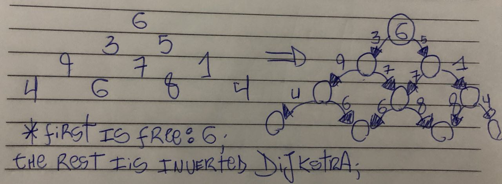

# Hells-triangle
hells triange challange

## Prerequisites
* node & npm

## Running the tests
* npm install
* npm run test

## How I solved it
I basically treated the triangle as a graph and applied an inverted Dijkstra algorithm to find the longest path from top to bottom, it does have some euristics, for instance, I use a currentLine counter because I know I don't have to calculate from botttom to top, the same way one line can only connet to its next.

## Language and testing framework
Exercises such as this one can be performed in pretty much any language, I choose js simply because it is very easy to setup a testing environment and to be honest, I am used to it.

I used JEST by facebook to create a few UT's, it even generates a coverage report once the tests are ran.